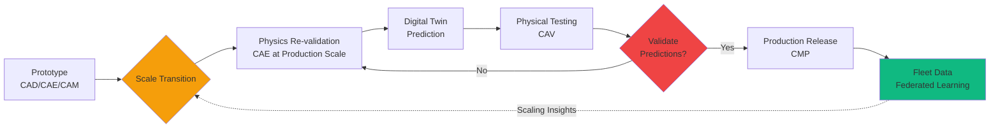

# CAx Lifecycle: 9 Phases "To Scale"

## Overview

IDEALE-EU captures the complete engineering lifecycle across 9 Computer-Aided (CAx) phases, addressing the critical challenge of **non-linear scaling** from prototype to production.

## The 9 CAx Phases

### 1. CAD – Computer-Aided Design

**Purpose**: Create parametric 3D models and engineering drawings

**Key Activities**:
- Parametric solid modeling
- Assembly design and kinematics
- Drawing generation and annotations
- Design version control with QS anchoring

**Tools Integration**: SolidWorks, CATIA V5/V6, Siemens NX, PTC Creo

**TFA Domains**: AAA (airframes), MMM (mechanical), PPP (propulsion)

---

### 2. CAE – Computer-Aided Engineering

**Purpose**: Simulate and analyze designs before physical prototyping

**Key Activities**:
- Finite Element Analysis (FEA)
- Computational Fluid Dynamics (CFD)
- Multidisciplinary Design Optimization (MDO)
- Results QS-anchored for certification evidence

**Tools Integration**: ANSYS, Abaqus, MSC Nastran, OpenFOAM

**TFA Domains**: AAA (structures), PPP (aero/thermal), EEE (electromagnetics)

---

### 3. CAI – Computer-Aided Innovation

**Purpose**: Systematic innovation and creative problem solving

**Key Activities**:
- TRIZ methodology application
- Design thinking workshops
- Ideation provenance tracking
- Innovation portfolio management

**Tools Integration**: IdeaScale, Miro, Innovation Suite

**TFA Domains**: IIS (knowledge management), OOO (optimization), LIB (IP tracking)

---

### 4. CAO – Computer-Aided Optimization

**Purpose**: Automated design space exploration and multi-objective optimization

**Key Activities**:
- Topology optimization
- Size and shape optimization
- Multi-objective Pareto frontiers
- Optimization iteration history with QS anchoring

**Tools Integration**: Optimus, modeFRONTIER, Tosca

**TFA Domains**: AAA (structures), PPP (propulsion), OOO (performance)

---

### 5. CAM – Computer-Aided Manufacturing

**Purpose**: Generate manufacturing programs and validate producibility

**Key Activities**:
- CNC toolpath generation
- Additive manufacturing (AM) strategies
- DFM (Design for Manufacturing) checks
- Manufacturing simulation

**Tools Integration**: Mastercam, Siemens NX CAM, Fusion 360

**TFA Domains**: IIF (manufacturing), MMM (processes), LIB (production tracking)

---

### 6. CAP – Computer-Aided Planning

**Purpose**: Assembly sequencing, resource allocation, and production planning

**Key Activities**:
- Assembly sequence planning
- Work cell layout optimization
- Cycle time analysis
- Resource scheduling

**Tools Integration**: Delmia, Process Simulate, FlexSim

**TFA Domains**: IIF (facilities), LIB (logistics), OOO (operations)

---

### 7. CAV – Computer-Aided Validation

**Purpose**: Virtual and physical testing for certification evidence

**Key Activities**:
- Digital twin validation
- Test procedure automation
- Measurement data correlation
- Certification evidence packages

**Tools Integration**: TestStand, DIAdem, ASAM standards

**TFA Domains**: AAA (certification), EDI (instrumentation), MMM (testing)

---

### 8. CMP – Component Management Process

**Purpose**: Configuration management across production lifecycle

**Key Activities**:
- As-designed vs as-built reconciliation
- Engineering change management (ECR/ECO/CCB)
- Serial number tracking
- Configuration baselines with QS anchoring

**Tools Integration**: PLM systems (Teamcenter, Windchill, 3DEXPERIENCE)

**TFA Domains**: LIB (configuration), All domains (change impact)

---

### 9. CAS – Computer-Aided Styling

**Purpose**: Industrial design, aesthetics, and human factors

**Key Activities**:
- Surface modeling and Class-A surfacing
- Ergonomics analysis
- Virtual reality reviews
- Brand identity integration

**Tools Integration**: Alias, ICEM Surf, VRED

**TFA Domains**: CCC (cockpit/cabin), AAA (external aesthetics)

---

## "To Scale" Methodology

### The Scaling Challenge

**Physics Don't Scale Linearly**: When moving from prototype to full-scale production:

- **Aerodynamics**: Reynolds number effects change flow characteristics
- **Combustion**: Flame stability and mixing patterns shift at scale
- **Structures**: Stress distributions and buckling modes differ
- **Thermal**: Heat transfer rates and thermal gradients vary

### IDEALE-EU "To Scale" Approach

**Key Principles**:

1. **Re-validate each CAx phase** when scaling
2. **QS-anchor** both prototype and production data
3. **Digital twin predictions** must match physical reality
4. **Federated learning** captures fleet-wide scaling effects
5. **Configuration management** ensures traceability across scale transitions

### Example: H2 Propulsion Scaling

**Prototype (ground demonstrator)**:
- 100 kW fuel cell system
- Laboratory-scale cryogenic tank
- Benchtop testing environment

**Production (commercial aircraft)**:
- 10 MW fuel cell system (100x power)
- Flight-qualified LH2 tank (1000x volume)
- Altitude and thermal cycling requirements

**Scaling Issues Addressed**:
- Cryogenic boil-off rates (non-linear with tank size)
- Fuel cell stack thermal management (different cooling strategies)
- Hydrogen distribution pressure drops (pipe diameter optimization)
- Safety systems (detection zones scale differently)

**TFA Domain Flow**:
- **CQH**: Hydrogen system design and cryogenics
- **PPP**: Integration with propulsion architecture  
- **CAE**: Thermal and flow simulations at both scales
- **CAV**: Testing campaign with QS-anchored evidence
- **CMP**: Configuration control through scaling transition
- **LIB**: Component traceability from prototype parts to production

## CAx Integration with TFA Domains

| CAx Phase | Primary TFA Domains | QS Anchoring |
|-----------|---------------------|--------------|
| CAD | AAA, MMM, PPP | Design versions, parametric history |
| CAE | AAA, PPP, EEE | Simulation setups, results, validation |
| CAI | IIS, OOO | Innovation provenance, IP tracking |
| CAO | AAA, PPP, OOO | Optimization iterations, Pareto sets |
| CAM | IIF, MMM | Toolpaths, manufacturing programs |
| CAP | IIF, LIB, OOO | Assembly sequences, schedules |
| CAV | AAA, EDI, MMM | Test procedures, measurements, evidence |
| CMP | LIB, All | Configuration baselines, changes (ECR/ECO) |
| CAS | CCC, AAA | Surface models, ergonomics studies |

## Workflow Examples

### New Aircraft Design Program

1. **CAD** (AAA): Baseline airframe design
2. **CAE** (AAA): Aerodynamic and structural analysis
3. **CAI** (IIS): Innovation reviews for novel concepts
4. **CAO** (AAA): Wing optimization for weight and performance
5. **CAV** (AAA): Wind tunnel testing, correlation to CFD
6. **"To Scale"**: Validate full-scale aerodynamics
7. **CAM** (IIF): Tooling design for composite layup
8. **CAP** (IIF): Assembly line layout
9. **CMP** (LIB): Configuration management through production
10. **CAS** (CCC): Cabin styling and passenger experience

### H2 Propulsion Retrofit

1. **CAD** (CQH, PPP): Cryogenic tank and fuel system design
2. **CAE** (CQH): Thermal analysis at -253°C
3. **CAO** (CQH): Insulation thickness optimization
4. **CAV** (CQH): Cryogenic testing with LH2
5. **"To Scale"**: Validate production tank at flight scale
6. **CAM** (IIF): Specialized manufacturing for cryo vessels
7. **CMP** (LIB): Track every production tank with digital passport
8. **Fleet**: Federated learning on boil-off rates

## Integration with PLUMA

**PLUMA (Product Lifecycle UiX Management Automation)** orchestrates CAx workflows:

- **Automated transitions** between CAx phases with gates
- **Compliance checking** at each phase (DFM, DFA, certification requirements)
- **Document generation** following S1000D with CSDB integration
- **Stakeholder notifications** for review and approval
- **QS anchoring** of all deliverables for tamper-proof audit trails

## Best Practices

### Design Phase (CAD/CAE/CAI/CAO)

- ✅ Use parametric models for easy scaling adjustments
- ✅ QS-anchor major design reviews and configuration baselines
- ✅ Document scaling assumptions and similarity parameters
- ✅ Plan for "to scale" validation early

### Manufacturing Phase (CAM/CAP)

- ✅ Simulate manufacturing processes before tooling investment
- ✅ Validate DFM rules with actual production data
- ✅ Track tooling configurations with digital passports
- ✅ Use federated learning for process optimization

### Validation Phase (CAV)

- ✅ Correlate simulations (CAE) with test data
- ✅ Build certification evidence packages incrementally
- ✅ QS-anchor all test results for regulatory submission
- ✅ Maintain "frozen context" for certification basis

### Configuration Phase (CMP)

- ✅ Implement rigorous ECR/ECO/CCB processes
- ✅ Link changes back to affected CAx phases
- ✅ Maintain as-designed vs as-built reconciliation
- ✅ Use LIB domain for complete traceability

## Standards and Compliance

- **ISO 10303 (STEP)**: CAD data exchange
- **JT Open**: Lightweight 3D visualization
- **LOTAR**: Long-term archiving of CAD/CAE data
- **ASAM**: Test automation and data management
- **S1000D**: Technical publications with CSDB
- **ATA iSpec 2200**: Data exchange standards

## Next Steps

- [TFA Domains Reference](/docs/tfa-domains/) - Domain responsibilities
- [Quick Start Guide](/docs/quick-start/) - Begin using the platform
- [API Reference](/api/) - Programmatic access to CAx data

---

*CAx Lifecycle: Capturing complete engineering evolution with "to scale" validation and QS evidence anchoring*
