# 02-AIRCRAFT Architecture Overview

This document provides a visual representation of the aircraft design and integration architecture for the IDEALE-EU project.

## System Architecture Diagram

```mermaid
graph TB
    subgraph "02-AIRCRAFT: Aircraft Design & Integration"
        ROOT[02-AIRCRAFT]
        
        ROOT --> MI[MODEL_IDENTIFICATION<br/>TFA Structure]
        ROOT --> CB[CONFIGURATION_BASE<br/>ATA Chapter Systems]
        ROOT --> CSI[CROSS_SYSTEM_INTEGRATION<br/>17 Integration Areas]
        ROOT --> DTM[DIGITAL_TWIN_MODEL<br/>13 Digital Twin Components]
        ROOT --> FAO[FINAL_ASSEMBLY_OPS<br/>Assembly Operations]
        ROOT --> CAP[CORRECTIVE_ACTION_PLAN.md]
        ROOT --> VR[VALIDATION_REPORT.md]
    end
    
    subgraph "MODEL_IDENTIFICATION: Threading Functional Architecture"
        MI --> PROD[AMPEL360-AIR-T<br/>Product Line]
        PROD --> ARCH[Architecture Variants<br/>BWB-H2-Hy-E, etc.]
        ARCH --> FAM[Product Families<br/>Q100_STD01, etc.]
        FAM --> DOM[Engineering Domains<br/>AAA, CCC, GGG, etc.]
        DOM --> ATA_SYS[ATA Systems<br/>per Domain]
        
        MI --> NAV[NAVIGATION_INDEX.md]
        MI --> TFA_DOCS[TFA Documentation<br/>Quick Reference, Structure, Implementation]
        MI --> SCRIPTS[scripts/<br/>Automation Tools]
        MI --> TOOLS[tools/<br/>Support Utilities]
        MI --> MAKE[Makefile<br/>Build Automation]
    end
    
    subgraph "CONFIGURATION_BASE: ATA Chapter Organization"
        CB --> COMMON[ATA-00_GENERAL]
        CB --> ATA05[ATA-05 Time Limits & Maint Checks]
        CB --> ATA06[ATA-06 Dimensions & Areas]
        CB --> ATA08[ATA-08 Leveling & Weighing]
        CB --> ATA11[ATA-11 Placards & Markings]
        CB --> ATA12[ATA-12 Servicing]
        CB --> ATA20[ATA-20 Standard Practices]
        CB --> ATA21[ATA-21 Air Conditioning]
        CB --> ATA22[ATA-22 Auto Flight]
        CB --> ATA23[ATA-23 Communications]
        CB --> ATA24[ATA-24 Electrical Power]
        CB --> ATA25[ATA-25 Equipment & Furnishings]
        CB --> ATA26[ATA-26 Fire Protection]
        CB --> ATA27[ATA-27 Flight Controls]
        CB --> ATA28[ATA-28 Fuel]
        CB --> ATA29[ATA-29 Hydraulic Power]
        CB --> ATA30[ATA-30 Ice & Rain Protection]
        CB --> ATA_MORE[+ 30 more ATA chapters...]
    end
    
    subgraph "CROSS_SYSTEM_INTEGRATION: 17 Integration Areas"
        CSI --> CSI01[01 Architecture End-to-End]
        CSI --> CSI02[02 Networks & Data Bus]
        CSI --> CSI03[03 Time Synchronisation]
        CSI --> CSI04[04 Power & Thermal Crossload]
        CSI --> CSI05[05 IMA Integration]
        CSI --> CSI06[06 Software Integration]
        CSI --> CSI07[07 Integration Test]
        CSI --> CSI08[08 Safety & Security]
        CSI --> CSI09[09 Config Baselines & Handoff]
        CSI --> CSI10[10 ICD Links]
        CSI --> CSI11[11 Models & Simulation]
        CSI --> CSI12[12 Operations & Fleet Feedback]
        CSI --> CSI13[13 Data]
        CSI --> CSI14[14 Metrics]
        CSI --> CSI15[15 Automation]
        CSI --> CSI16[16 Compliance]
        CSI --> CSI17[17 Links]
    end
    
    subgraph "DIGITAL_TWIN_MODEL: 13 Components"
        DTM --> DTM01[01 Architecture]
        DTM --> DTM02[02 Models]
        DTM --> DTM03[03 Interfaces & APIs]
        DTM --> DTM04[04 Versioning & Config]
        DTM --> DTM05[05 Calibration & Alignment]
        DTM --> DTM06[06 Validation & Verification]
        DTM --> DTM07[07 Runtime & Deployment]
        DTM --> DTM08[08 Synchronisation]
        DTM --> DTM09[09 Integrations]
        DTM --> DTM10[10 Metrics]
        DTM --> DTM11[11 Safety & Compliance]
        DTM --> DTM12[12 Code]
        DTM --> DTM13[13 Templates]
    end
    
    subgraph "Integration Flow"
        MI -.TFA Structure.-> CB
        CB -.System Configs.-> CSI
        CSI -.Integration Data.-> DTM
        DTM -.Validated Models.-> FAO
        FAO -.Assembly Feedback.-> CAP
        CAP -.Corrective Actions.-> VR
    end
    
    style ROOT fill:#2563eb,stroke:#1e40af,color:#fff,stroke-width:3px
    style MI fill:#059669,stroke:#047857,color:#fff,stroke-width:2px
    style CB fill:#dc2626,stroke:#b91c1c,color:#fff,stroke-width:2px
    style CSI fill:#ea580c,stroke:#c2410c,color:#fff,stroke-width:2px
    style DTM fill:#7c3aed,stroke:#6d28d9,color:#fff,stroke-width:2px
    style FAO fill:#0891b2,stroke:#0e7490,color:#fff,stroke-width:2px
```



## Architecture Key Components

### 1. **MODEL_IDENTIFICATION** (TFA - Threading Functional Architecture/Artifact)
The hierarchical product structure:
- **AMPEL360-AIR-T**: Main product line
- **Architecture variants**: Different configurations (e.g., BWB-H2-Hy-E - Blended Wing Body with Hydrogen Hybrid Electric)
- **Product families**: Specific family variants (e.g., Q100_STD01)
- **Engineering domains**: Organized by domain codes (AAA, CCC, GGG, etc.)
- **ATA systems**: Mapped to ATA Spec 100 chapters
- **Automation**: Includes Makefile, scripts, and tools for structure management
- **Documentation**: Navigation index, quick reference, structure diagrams, implementation summaries

### 2. **CONFIGURATION_BASE** (ATA Chapter Systems)
Organized by **ATA Spec 100** chapters (40+ chapters total):
- **ATA-05**: Time Limits & Maintenance Checks
- **ATA-21-28**: Environmental & Systems (Air Conditioning, Auto Flight, Communications, Electrical, Equipment, Fire, Flight Controls, Fuel)
- **ATA-29-38**: Hydraulic, Ice/Rain, Indicating, Landing Gear, Lights, Navigation, Oxygen, Pneumatic, Water/Waste
- **ATA-42-50**: Advanced Systems (IMA, Cabin Systems, Central Maintenance, Information Systems, Inert Gas, APU, Cargo)
- **ATA-51-57**: Structures (General Structures, Doors, Fuselage, Nacelles/Pylons, Stabilizers, Windows, Wings)
- **ATA-70-80**: Powerplant (Practices, Powerplant, Engine, Fuel Control, Ignition, Bleed Air, Controls, Indicating, Exhaust, Oil, Starting)
- **ATA-92**: EWIS (Electrical Wiring Interconnection System)

### 3. **CROSS_SYSTEM_INTEGRATION** (17 Areas)
Comprehensive integration framework:
1. **Architecture End-to-End**: Overall system architecture
2. **Networks & Data Bus**: Communication infrastructure (ARINC, Ethernet, etc.)
3. **Time Synchronisation**: System-wide timing
4. **Power & Thermal Crossload**: Energy and thermal management
5. **IMA Integration**: Integrated Modular Avionics (DO-297)
6. **Software Integration**: Software across systems
7. **Integration Test**: Test procedures and results
8. **Safety & Security**: ARP4761, DO-326A compliance
9. **Config Baselines & Handoff**: Configuration management
10. **ICD Links**: Interface Control Documents
11. **Models & Simulation**: Simulation artifacts
12. **Operations & Fleet Feedback**: Operational data
13. **Data**: Integration data management
14. **Metrics**: Performance metrics
15. **Automation**: Automated integration tools
16. **Compliance**: Regulatory compliance tracking
17. **Links**: External references

### 4. **DIGITAL_TWIN_MODEL** (13 Components)
Complete digital twin implementation:
1. **Architecture**: Digital twin structure
2. **Models**: Physics-based, data-driven models
3. **Interfaces & APIs**: External connections
4. **Versioning & Config**: Model version control
5. **Calibration & Alignment**: Model tuning
6. **Validation & Verification**: V&V activities
7. **Runtime & Deployment**: Execution environment
8. **Synchronisation**: Real-time data sync
9. **Integrations**: System integrations
10. **Metrics**: Model performance metrics
11. **Safety & Compliance**: Certification alignment
12. **Code**: Implementation code
13. **Templates**: Reusable templates

### 5. **FINAL_ASSEMBLY_OPS**
Assembly line operations and procedures for physical aircraft integration.

### 6. **Supporting Documents**
- **CORRECTIVE_ACTION_PLAN.md**: Issues and corrective actions
- **VALIDATION_REPORT.md**: Validation results and findings

## Data Flow & Integration

```
MODEL_IDENTIFICATION (TFA Structure)
    ↓ defines systems for
CONFIGURATION_BASE (ATA Systems)
    ↓ configuration data to
CROSS_SYSTEM_INTEGRATION (17 Areas)
    ↓ integration requirements to
DIGITAL_TWIN_MODEL (13 Components)
    ↓ validated models to
FINAL_ASSEMBLY_OPS
    ↓ feedback to
CORRECTIVE_ACTION_PLAN & VALIDATION_REPORT
```

## Key Observations

1. **ATA Spec 100 Compliance**: CONFIGURATION_BASE is organized by full ATA chapter structure
2. **TFA Implementation**: MODEL_IDENTIFICATION implements a complete Threading Functional Architecture
3. **Comprehensive Integration**: 17 specialized areas cover all integration aspects
4. **Digital Twin Maturity**: 13-component structure shows advanced digital twin implementation
5. **Automation Support**: Scripts, tools, and Makefile for structure management
6. **Traceability**: Clear flow from product structure → systems → integration → digital twin → assembly

## What to Do Next

### Immediate Actions
1. **Review TFA Documentation**: Start with `MODEL_IDENTIFICATION/NAVIGATION_INDEX.md` and `TFA_QUICK_REFERENCE.md`
2. **Understand ATA Mapping**: Review how your systems map to ATA chapters in CONFIGURATION_BASE
3. **Check Integration Status**: Review the 17 areas in CROSS_SYSTEM_INTEGRATION for completeness
4. **Validate Digital Twin**: Ensure Digital Twin models align with physical configuration

### Workflow Optimization
1. **Use Automation Tools**: Leverage the Makefile and scripts in MODEL_IDENTIFICATION for structure generation
2. **Follow TFA Hierarchy**: Always use Product → Architecture → Family → Domain → ATA → System structure
3. **Maintain ICD Links**: Keep Interface Control Documents updated in CROSS_SYSTEM_INTEGRATION/10-ICD_LINKS
4. **Sync Baselines**: Ensure CONFIGURATION_BASE and CROSS_SYSTEM_INTEGRATION/09-CONFIG_BASELINES_HANDOFF are aligned

### Development Enhancement
1. **Complete ATA Coverage**: Verify all relevant ATA chapters have content in CONFIGURATION_BASE
2. **Digital Twin Calibration**: Focus on DTM 05-CALIBRATION_ALIGNMENT to match physical aircraft
3. **Integration Testing**: Expand CROSS_SYSTEM_INTEGRATION/07-INTEGRATION_TEST with comprehensive test cases
4. **Metrics Dashboard**: Implement tracking using CSI/14-METRICS and DTM/10-METRICS

### Consistency Maintenance
1. **ATA Standard Adherence**: All systems must follow ATA Spec 100 / iSpec 2200 numbering
2. **TFA Structure Compliance**: Use automation tools to validate structure consistency
3. **Traceability**: Maintain links from TFA → ATA → Integration → Digital Twin
4. **Version Control**: Use DIGITAL_TWIN_MODEL/04-VERSIONING_CONFIG for all model changes

---

**Document Status**: Corrected Architecture Overview v2.0  
**Last Updated**: 2025-10-15 02:51:11 UTC  
**Author**: @Robbbo-T  
**Repository**: IDEALE-eu/IDEALEEU.EU
