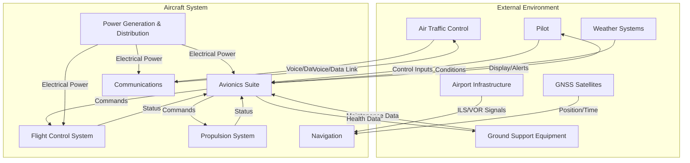
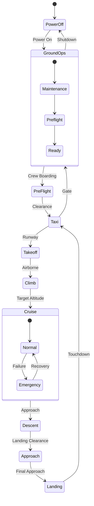

# System Context Diagram

## Overview

This document defines the aircraft system context, external interfaces, and operational modes using Mermaid and SysML-style diagrams.

## System Context

### Aircraft System Boundary

## External Interfaces

### Human Interfaces
- **Pilot** - Flight crew inputs and displays
- **Cabin Crew** - Passenger management and safety
- **Maintenance Personnel** - Ground maintenance and diagnostics

### Environmental Interfaces
- **GNSS** - GPS, Galileo, GLONASS positioning and time
- **Weather Systems** - Temperature, pressure, wind data
- **Electromagnetic Environment** - DO-160 compliance

### Infrastructure Interfaces
- **Air Traffic Control** - Voice and data link communications
- **Ground Support Equipment** - Maintenance, fueling, power
- **Airport Systems** - ILS, VOR, DME navigation aids

## Operational Modes

### Flight Modes

### System Operating Modes
- **Normal** - All systems nominal
- **Degraded** - One or more system failures, reconfiguration active
- **Emergency** - Critical failure, emergency procedures active
- **Maintenance** - Ground mode, diagnostics and servicing
- **Safe Mode** - Minimal functionality, fail-safe state

## Functional Allocation

### Primary Functions
- **Navigation** - Position determination and guidance
- **Flight Control** - Attitude and trajectory control
- **Propulsion Management** - Thrust and fuel control
- **Power Management** - Electrical power generation and distribution
- **Communications** - Voice and data communications
- **Monitoring** - System health and flight parameters

### Cross-System Functions
- **Time Synchronization** - System-wide time reference (03-TIME_SYNCHRONISATION/)
- **Data Distribution** - Network backbone (02-NETWORKS_DATA_BUS/)
- **Health Monitoring** - System-wide FDIR (06-SOFTWARE_INTEGRATION/SAFETY_MONITORS.md)
- **Configuration Management** - Software and hardware baselines (09-CONFIG_BASELINES_HANDOFF/)

## Traceability

This context diagram satisfies:
- **System Requirements** - See [00-PROGRAM/DIGITAL_THREAD/04-MBSE/REQUIREMENTS_ALLOCATION.csv](../../../../00-PROGRAM/DIGITAL_THREAD/04-MBSE/REQUIREMENTS_ALLOCATION.csv)
- **Architecture Views** - See [00-PROGRAM/DIGITAL_THREAD/04-MBSE/SYSML_MODELS/](../../../../00-PROGRAM/DIGITAL_THREAD/04-MBSE/)
- **Interface Definitions** - See [10-ICD_LINKS/INDEX.md](../../10-ICD_LINKS/INDEX.md)

## References
- **ARP4754A** - Section 3, System Context
- **02-AIRCRAFT/00-README.md** - Aircraft domain overview
- **[ASSUMPTIONS_CONSTRAINTS.md](./ASSUMPTIONS_CONSTRAINTS.md)** - Design assumptions and constraints

## Revision History

| Version | Date | Author | Description |
|---------|------|--------|-------------|
| 1.0 | 2024-10-08 | Systems Architecture Team | Initial context diagram |
