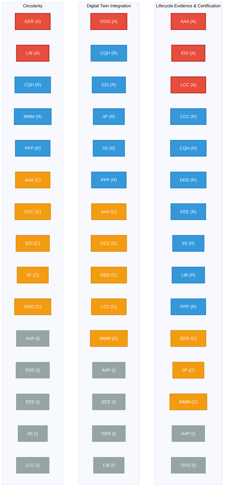

# Domain-Level RACI for Strategic Aerospace Imperatives (Q100_STD01)

## Overview

This matrix defines the roles of the **15 Engineering Domains** with respect to the three emerging strategic imperatives:

1. **Lifecycle Evidence & Certification** (V-Cycle rigor, ARP4754B/ARP4761A, DO-x suite)  
2. **Digital Twin Integration** (SysML v2, trustworthiness, predictive analytics)  
3. **Circularity** (Design for Circularity, AFRA BMP v5.1, IAEG, Digital Product Passports)

---

## 📊 RACI Matrix

| Domain | Lifecycle Evidence & Certification | Digital Twin Integration | Circularity |
|--------|------------------------------------|--------------------------|-------------|
| **1. AAA** | **A** (Final Certification, Structural Integrity) | **C** (Structural Model Correlation & Analysis) | **C** (Airframe Life Extension Assessment) |
| **2. AAP** | **I** (Ground Interface Evidence) | **I** (Ground Operations Modeling) | **I** (Ground Support/Platform Reuse) |
| **3. CCC** | **R** (Cabin/IFE System Assurance) | **C** (Interior Design & IFE Modeling) | **C** (Interior Material Lifecycle/Reuse) |
| **4. CQH** | **R** (Cryo/H₂ Safety Case Evidence) | **R** (H₂/Cryo System Performance Modeling) | **R** (H₂/Cryo Material & Containment Lifecycle) |
| **5. DDD** | **R** (Environmental Control Evidence) | **C** (Thermal/Fluid Performance Twin) | **I** (System Waste/Fluid Management) |
| **6. EDI** | **A** (Avionics SW/HW Assurance, IMA) | **R** (Operational DT Implementation, Data Pipeline Security) | **C** (Electronic Component DfC/Recyclability) |
| **7. EEE** | **R** (EWIS/ATA-92 Assurance) | **I** (Wiring Harness Modeling) | **I** (Electrical Component Reuse) |
| **8. EER** | **C** (Fire/Emissions Evidence) | **I** (Emissions/Noise Modeling) | **A** (Environmental Framework, ISO 59004/IAEG) |
| **9. IIF** | **C** (Production Process Evidence) | **R** (Enterprise/Manufacturing Twin Implementation) | **C** (Manufacturing Waste Reduction) |
| **10. IIS** | **R** (AI/ML Assurance Governance) | **R** (Information Architecture & Data Analytics) | **I** (Reporting & Metrics Analytics) |
| **11. LCC** | **A** (CM, Traceability & System Integration) | **C** (DT for Control System Behavior) | **I** (Integration for Circularity) |
| **12. LIB** | **R** (Records & Limitations Traceability) | **I** (Historical Data Provisioning) | **A** (DPP, EOL Logistics & Records, AFRA BMP v5.1) |
| **13. MMM** | **C** (Mechanical System Evidence) | **C** (Mechanical System Modeling) | **R** (Design for Circularity, ASTM E3461-25) |
| **14. OOO** | **I** (OS/Platform Standards Provision) | **A** (DT Taxonomy, Trustworthiness Governance, SysML v2) | **C** (Circularity Reporting Standards) |
| **15. PPP** | **R** (Engine/Fuel System Evidence) | **R** (Engine Performance DT Modeling) | **R** (IATA Net-Zero Implementation & Component Remanufacture) |

---

## 🔑 Key to RACI Roles

- **A (Accountable):** Domain with ultimate ownership; approves the final decision or deliverable.  
- **R (Responsible):** Domain that executes the work and implements the standards.  
- **C (Consulted):** Domain whose expertise is sought; two-way communication.  
- **I (Informed):** Domain kept up-to-date; one-way communication.  

---

## 📈 Visualizations

### RACI Matrix Heatmap

This diagram visualizes the distribution of RACI assignments across domains and imperatives.

### Domain Accountability Flow

This diagram shows which domains have **Accountable** roles across the three strategic imperatives.

### Imperative Coverage by Domain

This diagram visualizes how many responsibilities each domain has across all imperatives.

```mermaid
%%{init: {'theme':'base', 'themeVariables': { 'fontSize':'14px'}}}%%
graph TD
    subgraph "Heavy Execution Load (Responsible)"
        CQH["CQH: 3R<br/>H₂/Cryo Systems"]:::heavy
        PPP["PPP: 3R<br/>Propulsion"]:::heavy
        IIS["IIS: 2R<br/>Information Systems"]:::heavy
        EDI["EDI: 1A + 1R<br/>Electronics-Digital"]:::heavy
    end
    
    subgraph "Strategic Oversight (Accountable)"
        AAA_A["AAA: 1A<br/>Certification"]:::oversight
        LCC_A["LCC: 1A<br/>CM & Integration"]:::oversight
        EER_A["EER: 1A<br/>Environmental"]:::oversight
        LIB_A["LIB: 1A<br/>DPP & Records"]:::oversight
        OOO_A["OOO: 1A<br/>DT Governance"]:::oversight
    end
    
    subgraph "Advisory & Support (Consulted/Informed)"
        AAP["AAP: 3I<br/>Ground Ops"]:::support
        DDD["DDD: 1R + 1C + 1I"]:::support
        EEE["EEE: 1R + 2I"]:::support
        CCC["CCC: 1R + 2C"]:::support
        IIF["IIF: 1R + 2C"]:::support
        MMM["MMM: 1R + 2C"]:::support
    end
    
    classDef heavy fill:#3498db,stroke:#2980b9,color:#fff,stroke-width:3px
    classDef oversight fill:#e74c3c,stroke:#c0392b,color:#fff,stroke-width:3px
    classDef support fill:#f39c12,stroke:#d68910,color:#fff,stroke-width:2px
```

### Domain Responsibility Distribution

---

## 🎯 Key Insights

This matrix provides a **clear governance backbone**:

### Accountable Anchors

The following domains emerge as **Accountable anchors** across the three imperatives:

- **AAA** (Airframes-Aerodynamics-Airworthiness): Final certification and structural integrity
- **EDI** (Electronics-Digital-Instruments): Avionics SW/HW assurance and operational DT implementation
- **LCC** (Linkages-Control-Communications): Configuration management and system integration
- **EER** (Environmental-Emissions-Remediation): Environmental framework and ISO 59004/IAEG
- **LIB** (Logistics-Inventory-Blockchain): Digital Product Passports, EOL logistics
- **OOO** (OS-Ontologies-Office): Digital Twin taxonomy and trustworthiness governance

### Heavy Execution Load

The following domains carry heavy **Responsible loads**, ensuring operational execution:

- **CQH** (Cryogenics-Quantum-H₂): 3 Responsible roles across all imperatives
- **DDD** (Drainage-Dehumidification-Drying): Environmental control systems
- **EEE** (Electrical-Endocircular-Energization): EWIS/electrical systems
- **IIS** (Information-Intelligence-Systems): AI/ML governance and data analytics
- **PPP** (Propulsion-Power-Plants): 3 Responsible roles for engines and sustainability

### Circularity Distribution

**Circularity accountability** is distributed across:

- **EER**: Environmental framework (Accountable)
- **LIB**: Digital Product Passports and end-of-life logistics (Accountable)
- **MMM**: Design for Circularity, ASTM E3461-25 (Responsible)
- **PPP**: IATA Net-Zero implementation and component remanufacture (Responsible)

This reflects the multi-domain nature of sustainability initiatives.

---

## 📚 Standards References

### Lifecycle Evidence & Certification
- **ARP4754B**: Guidelines for Development of Civil Aircraft and Systems
- **ARP4761A**: Guidelines and Methods for Conducting the Safety Assessment Process
- **DO-178C**: Software Considerations in Airborne Systems and Equipment Certification
- **DO-254**: Design Assurance Guidance for Airborne Electronic Hardware
- **DO-160**: Environmental Conditions and Test Procedures for Airborne Equipment

### Digital Twin Integration
- **SysML v2**: Systems Modeling Language version 2
- **ISO/IEC 30141**: Internet of Things Reference Architecture
- **IEEE 1730**: Recommended Practice for Distributed Simulation Engineering and Execution Process
- **DTDL**: Digital Twins Definition Language

### Circularity
- **AFRA BMP v5.1**: Aircraft Fleet Recycling Association Best Management Practice
- **IAEG**: International Aerospace Environmental Group standards
- **ISO 59004**: Circular Economy - Terminology, Principles and Guidance for Implementation
- **ASTM E3461-25**: Standard Practice for Measuring Circularity
- **Digital Product Passport**: EU Battery Regulation 2023/1542

---

## 🔗 Related Documents

- [Q100_STD01 Family Configuration](./README.md)
- [Governance Framework](../../../../../../../00-PROGRAM/GOVERNANCE/README.md)
- [Configuration Management Plan](../../../../../../../00-PROGRAM/CONFIG_MGMT/01-CM_PLAN.md)
- [Domain Integration Overview](./DOMAIN/README.md)

---

## 📋 Change History

| Version | Date | Author | Changes |
|---------|------|--------|---------|
| 1.0 | 2025-10-19 | System | Initial creation with RACI matrix and diagrams |

---

**Status**: Active  
**Owner**: Program & Configuration Management  
**Review Cycle**: Quarterly or on major program milestones
