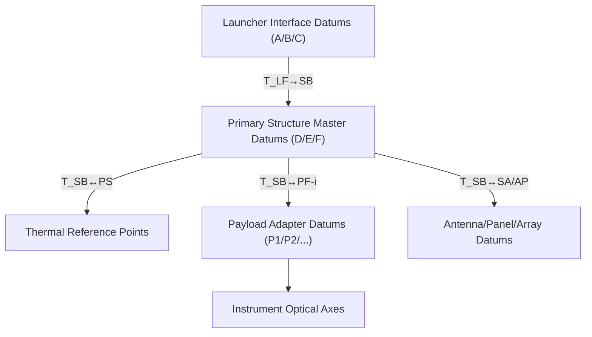

# 06-DIMENSIONS_ALIGNMENTS — Integration View

## Scope
Defines program-wide reference frames, datums, coordinate systems, and alignment chains for the satellite. Governs how structures, payloads, and avionics are positioned, measured, and verified from AIT through launch integration.

## Frames & Conventions
- **STA Body Frame (SB):** {+X fwd, +Y starboard, +Z nadir} (right-handed).
- **Launcher Frame (LF):** Per launch provider ICD; SB↔LF transform maintained in `FRAME_DEFS.yaml`.
- **Payload Frame(s) (PF-i):** One per instrument; rigidly tied to its mechanical interface datum set.
- **Units:** mm, arcsec (µrad), °C; uncertainties at **k=2** unless noted.

## Alignment Tree & Datums



- **Master datum set (D/E/F):** machined features on primary structure; golden reference for all surveys.
- **Thermal reference points:** matched to thermal model nodes for hot/cold correlations.

## Interfaces & Dependencies
- **51-PRIMARY_STRUCTURE / 53-STRUCTURES:** mounting datums, flatness, hole patterns.
- **57-INSTRUMENT_BAYS / 71-INSTRUMENTS:** optical/mechanical alignment to PF-i.
- **34-NAVIGATION_ATTITUDE:** star tracker/IMU boresight & lever arms.
- **31-DATA_HANDLING:** time tags for survey events; configuration baselines.
- **21-THERMAL_CONTROL / 75-RADIATORS:** thermo-elastic stability & gradients.
- **24-ELECTRICAL_POWER / 92-EWIS_HARNESS:** harness strain relief, connector reach.
- **07/10 MGSE:** metrology fixtures, handling carts.
- See `INTERFACE_MATRIX/06↔OTHERS.csv`.

## Key Parameters & Budgets
| Item                               | Symbol          | Requirement               | Verification                    |
|------------------------------------|-----------------|---------------------------|---------------------------------|
| CG location wrt SB origin          | r_CG            | ≤ ±2 mm per axis          | Mass props + survey (CMM)       |
| Panel planarity                    | δ_plane         | ≤ 0.3 mm RMS              | Laser tracker / CMM             |
| Instrument boresight to SB +X      | θ_bore          | ≤ 30 arcsec               | Autocollimator / theodolite     |
| Star tracker lever arm             | r_ST            | ≤ ±0.5 mm                 | Laser tracker                   |
| Antenna phase center to SB         | r_PC            | ≤ ±1.0 mm                 | RF/optical alignment + survey   |
| SB↔LF transform uncertainty        | U_T             | ≤ 0.5 mm / 20 arcsec      | Joint fit at launcher facility  |

> Full error budget: `ERROR_BUDGET.xlsx`.

## Measurement & Verification
- **Methods:** Laser tracker, photogrammetry, CMM, autocollimator, interferometer (optics as needed).
- **Process:** Define → Calibrate tools → Rough-in → Fine align → Thermal soak check → Final survey.
- **Data packs:** Raw points (`SURVEY_RAW/*.csv`), reduced frames (`SURVEY_REDUCED/*.csv`), signed report (`SURVEY_REPORT.pdf`).
- **Thermo-elastic correlation:** tie survey points to thermal model nodes; hot/cold delta ≤ limits.

## Operating Modes (geometry-relevant)
- **Launch-stowed:** meets LF keep-outs; latch preloads verified.
- **On-orbit-deployed:** deployed kinematics within ± tolerance; hinge line alignment recorded.

## Deliverables (this system)
- `FRAME_DEFS.yaml` — SB/LF/PF definitions and transforms.
- `DATUMS.csv` — Master datum coordinates & tolerances.
- `ALIGNMENT_TREE.md` — Authority tree & ownership.
- `MEASUREMENT_PLAN.md` — Instruments, sequences, uncertainties.
- `ERROR_BUDGET.xlsx` — Allocation & roll-up.
- `SURVEY_REPORT.pdf` — Signed measurement evidence.

## Change Control
Any change to **datums, frames, or transforms** requires ECR/ECO and re-verification of impacted interfaces. See `../../../../../../00-PROGRAM/CONFIG_MGMT/06-CHANGES/`.

## TBDs / Risks
| ID  | Description                                | Owner | Due  |
|-----|--------------------------------------------|-------|------|
| TBD-06-01 | Final launcher LF definition & tolerances | INT   | TBC  |
| R-06-01   | Thermal distortion vs. pointing margin   | THM   | TBC  |

**Links:** `INTERFACE_MATRIX/` • `../01-INTRO/` • Program CM baselines in `00-PROGRAM/CONFIG_MGMT/04-BASELINES/`.
```
