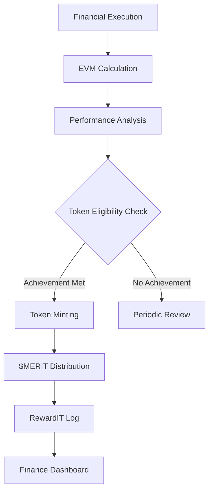

# Program Finance Office (PFO) - Digital Integration

## Enhanced Domain Structure with Token Integration

### Core Financial Processes with Token Rewards

#### 01-COST_MODELS/ (Enhanced)
- `parametric_with_tokens/` - Cost models that trigger token rewards for accuracy
- `should_cost_validation/` - Rewards for identifying cost reduction opportunities
- `digital_twin_cost_integration/` - Real-time cost correlation with physical assets

#### 02-BUDGET_PLANNING/ (Token-Enhanced)
- `bac_allocation_with_rewards/` - Budget allocation tied to performance incentives
- `spend_plan_optimization/` - Token rewards for efficient spend execution
- `contingency_management/` - Rewards for effective risk reserve utilization

#### 03-EVM/ (Real-time Integration)
- `real_time_evm_calculation/` - Live SPI/CPI with automatic token calculations
- `performance_trend_analysis/` - Pattern recognition for sustained performance
- `token_reward_triggers/` - Automated reward conditions based on EVM metrics

#### 04-FORECASTING/ (ML-Enhanced)
- `predictive_forecasting_with_rewards/` - Accuracy-based token allocation
- `scenario_analysis_tokens/` - Rewards for identifying optimal scenarios
- `risk_adjusted_forecasting/` - Token incentives for comprehensive risk assessment

#### 06-REPORTING/
- `rewardIT_LOG.csv` - Token reward achievement log
- Performance dashboards with token metrics
- Monthly finance reports with reward summaries

#### 08-TOOLS_AUTOMATION/ (Token Integration)
- `automated_reward_calculation/` - Real-time token allocation based on financial KPIs
- `finance_token_validator/` - Validation of financial achievement claims
- `reward_distribution_engine/` - Automated $MERIT and token distribution

### Token Reward Framework

#### Achievement Categories

**Cost Performance Excellence**
- Sustained CPI > 1.05 for 2+ periods: 100 tokens
- Identified cost savings > $100K: 50 tokens + 5% of savings as $MERIT
- Successful should-cost challenge: 25 tokens

**Schedule Performance**
- Sustained SPI > 1.03 for 2+ periods: 75 tokens
- Critical path acceleration > 10%: 50 tokens
- Milestone achievement ahead of schedule: 25 tokens

**Forecasting Accuracy**
- EAC accuracy within 2% for 3+ periods: 60 tokens
- Successful risk mitigation > $50K impact: 40 tokens
- Innovative forecasting methodology: 30 tokens

#### Verification Process

1. **Automated Validation** - System validates financial metrics
2. **Finance Board Review** - Manual verification for significant achievements
3. **Evidence Documentation** - Required supporting documentation
4. **Token Minting** - Automated NFT creation with UTCS anchoring

### Integration Flows



### Example Achievement Token

```json
{
  "token_id": "FINANCE-1700000000",
  "token_type": "cost_performance_excellence",
  "utcs_anchor": "utcs://BUSINESS/FINANCE/COST-PERFORMANCE",
  "achievement_date": "2024-01-15T10:30:00Z",
  "financial_impact": {
    "validated_savings": 150000,
    "sustained_periods": 3,
    "cpi_improvement": 0.07,
    "spi_improvement": 0.04
  },
  "rewards": {
    "merit_allocated": 7500,
    "token_units": 100
  }
}
```

### Quality Gates

- **Financial Data Validation** - Automated checks before token issuance
- **Board Approval Threshold** - Achievements > 50 tokens require board review
- **Anti-Gaming Mechanisms** - Prevention of artificial metric manipulation
- **Audit Trail** - Complete documentation for all token issuances

### Implementation Status

- [x] Basic token integration framework
- [x] EVM-to-token reward mapping
- [x] Automated achievement logging
- [ ] Real-time digital twin integration
- [ ] Machine learning reward optimization
- [ ] Cross-program performance benchmarking

### Technical Integration

#### Main Integration Module
**Location**: `/finance/teknia_finance_integration.py`

Key features:
- Financial impact reward calculation
- Token minting for achievements
- EVM integration with token rewards
- Merit allocation system

#### Automated Reward Calculator
**Location**: `08-TOOLS_AUTOMATION/automated_reward_calculator.py`

Capabilities:
- Period-based reward calculation
- Multi-category achievement assessment
- Performance trend analysis
- Recommendation generation

#### Configuration Files
- `/finance/teknia.tokenomics.json` - Token system configuration
- `finance_token_config.json` - Finance-specific reward rules

### Usage Examples

#### Basic EVM Integration
```python
from finance.teknia_finance_integration import FinanceTokenIntegration

integration = FinanceTokenIntegration()

evm_data = {
    'period': '2024-Q1',
    'SPI': 1.03,
    'CPI': 1.02,
    'TCPI': 1.01,
    'VAC': 50000,
    'EAC': 950000
}

result = integration.integrate_evm_with_tokens(evm_data)
print(f"Reward Units: {result['token_rewards']['reward_units']}")
```

#### Achievement Token Minting
```python
achievement_data = {
    'utcs_anchor': 'utcs://BUSINESS/FINANCE/EVM-PERFORMANCE',
    'validated_savings': 50000,
    'sustained_periods': 2,
    'cpi_delta': 0.02,
    'spi_delta': 0.03,
    'verification_status': 'verified',
    'board_approval': True,
    'supporting_docs': ['EVM_Report_2024_Q1.pdf']
}

token_id = integration.mint_achievement_token(achievement_data)
print(f"Minted token: {token_id}")
```

#### Period Reward Calculation
```python
from FINANCE.08-TOOLS_AUTOMATION.automated_reward_calculator import FinanceRewardCalculator

calculator = FinanceRewardCalculator()

period_data = {
    'period': '2024-Q1',
    'CPI': 1.07,
    'SPI': 1.04,
    'cost_savings': 150000,
    'forecast_accuracy': 0.99
}

rewards = calculator.calculate_period_rewards(period_data)
print(f"Total Rewards: {rewards['total_rewards']} tokens")
```

### Contacts & Responsibilities

- **Token Economics**: PFO Token Strategy Team
- **Technical Implementation**: Finance Automation Team
- **Validation & Approval**: Finance Review Board
- **System Integration**: Digital Twin Finance Team

### Getting Started

1. Review configuration files in `finance_token_config.json`
2. Set up finance root path in integration module
3. Configure reward thresholds based on program requirements
4. Initialize reporting directory for reward logs
5. Test integration with sample EVM data

### Governance & Compliance

All token rewards are subject to:
- Finance board review for significant achievements (>50 tokens)
- Automated validation checks
- Audit trail requirements
- Evidence documentation standards
- Anti-gaming monitoring

**Last Updated**: 2025-10-13  
**Version**: 1.0.0  
**Status**: Active 🟢
