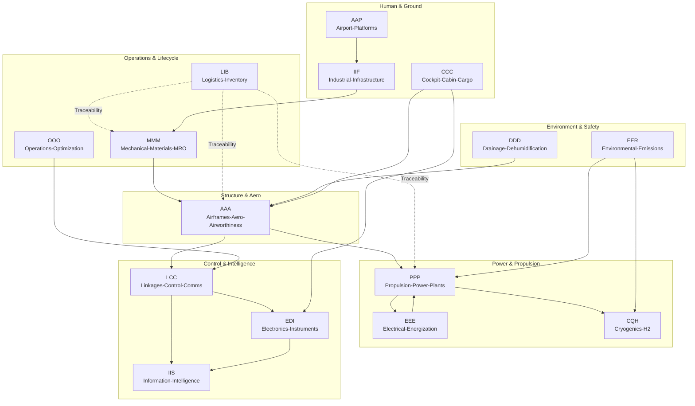

# TFA Domains Reference

## What is TFA?

**TFA (Threading Functional Architecture)** is IDEALE-EU's structural framework that organizes aerospace lifecycle management across 15 specialized domains. Each domain manages specific aspects of the complete product lifecycle from concept to retirement.

## Architecture Flow

**QS→FWD→UE→FE→CB→QB**

- **QS** (Quantum Superposition): Pre-event state capture with multiple potential outcomes in superposition before crystallization
- **FWD** (Future/Waves Dynamics): Predictive and retrodictive modeling
- **UE** (Unit Element): Classical fundamental units
- **FE** (Federation Entanglement): Distributed multi-party coordination
- **CB** (Classical Bit): Post-event deterministic reality anchoring
- **QB** (Qubit): Quantum computation strategies

## 15 Canonical Domains

### AAA – Airframes-Aerodynamics-Airworthiness

**Purpose**: Structural integrity, aerodynamic performance, and airworthiness certification

**Key Systems**:
- Dimensions and Stations (ATA 06)
- Structures General (ATA 51)
- Doors and Hatches (ATA 52)
- Fuselage (ATA 53)
- Wings (ATA 57)

**Typical Components**: Wing ribs, fuselage frames, stringers, skin panels, aerodynamic fairings

**Integration Points**: CCC (cabin integration), MMM (materials), EDI (strain gauges)

---

### AAP – Airport-Adaptable-Platforms

**Purpose**: Ground operations, ground support equipment, and airport infrastructure

**Key Systems**:
- Parking and Mooring (ATA 10)
- Towing and Ground Handling
- Airport Infrastructure Integration

**Typical Components**: Tow bars, chocks, ground power units, parking guidance systems

**Integration Points**: IIF (ground facilities), LIB (logistics), OOO (operations)

---

### CCC – Cockpit-Cabin-Cargo

**Purpose**: Flight deck, passenger accommodations, and cargo systems

**Key Systems**:
- Equipment and Furnishings (ATA 25)
- Passenger Seats
- Galleys and Lavatories
- Cargo Handling Systems

**Typical Components**: Pilot seats, instrument panels, passenger seats, overhead bins, cargo nets

**Integration Points**: EDI (instruments), EEE (cabin power), LCC (intercom)

---

### CQH – Cryogenics-Quantum-H2

**Purpose**: Hydrogen systems, cryogenic technology, and quantum sensing

**Key Systems**:
- LH2 Auxiliary Thermal Conditioning (ATA 47-20)
- Subcooler Cold Box
- Hydrogen Fuel Cells
- Quantum Sensors

**Typical Components**: Cryogenic tanks, insulation systems, H2 fuel lines, quantum gyroscopes

**Integration Points**: PPP (propulsion), EER (safety), EDI (quantum sensors)

---

### DDD – Drainage-Dehumidification-Drying

**Purpose**: Moisture control and environmental conditioning

**Key Systems**:
- Dehumidification ECS (ATA 21)
- Air Dryers and Desiccant Packs
- Drain Masts
- Condensation Management

**Typical Components**: Desiccant cartridges, drain valves, moisture separators

**Integration Points**: EER (environmental), AAA (structure drains)

---

### EDI – Electronics-Digital-Instruments

**Purpose**: Avionics, sensors, data acquisition, and instrumentation

**Key Systems**:
- Indicating and Recording (ATA 31)
- Flight Data Recorders (FDR)
- Cockpit Voice Recorders (CVR)
- Sensor Networks

**Typical Components**: Flight displays, data recorders, sensor modules, cockpit instruments

**Integration Points**: IIS (software), LCC (data buses), EEE (power)

---

### EEE – Electrical-Endocircular-Energization

**Purpose**: Electrical power generation, distribution, and energy harvesting

**Key Systems**:
- Electrical Power (ATA 24)
- Generators and APU
- Power Distribution
- Energy Harvesting Sensors

**Typical Components**: Generators, bus bars, circuit breakers, piezoelectric harvesters

**Integration Points**: PPP (engine-driven generators), EER (energy efficiency)

---

### EER – Environmental-Emissions-Remediation

**Purpose**: Fire protection, pollution control, and environmental sustainability

**Key Systems**:
- Fire Protection (ATA 26)
- Suppression Bottles and Lines
- Emissions Monitoring
- Noise Reduction

**Typical Components**: Fire extinguisher bottles, smoke detectors, emission sensors

**Integration Points**: CQH (H2 safety), DDD (environmental control)

---

### IIF – Industrial-Infrastructure-Facilities

**Purpose**: Manufacturing facilities, tooling, and industrial infrastructure

**Key Systems**:
- Lifting and Shoring (ATA 07)
- Aircraft Jacks and Tripods
- Manufacturing Tools
- Ground Support Facilities

**Typical Components**: Assembly jigs, lifting fixtures, manufacturing cells

**Integration Points**: AAP (GSE), LIB (inventory), MMM (tooling)

---

### IIS – Information-Intelligence-Systems

**Purpose**: Software, artificial intelligence, data analytics, and cybersecurity

**Key Systems**:
- Information Systems (ATA 46)
- Network Infrastructure
- AI/ML Platforms
- Cybersecurity

**Typical Components**: Flight management software, AI models, databases, firewalls

**Integration Points**: EDI (avionics), LCC (data links), LIB (supply chain analytics)

---

### LCC – Linkages-Control-Communications

**Purpose**: Flight control systems, datalinks, and communications

**Key Systems**:
- Auto Flight (ATA 22)
- Flight Control Computers (AFCS)
- Communications (ATA 23)
- Navigation (ATA 34)

**Typical Components**: Flight control actuators, autopilot computers, radios, antennas

**Integration Points**: EDI (instruments), AAA (control surfaces), IIS (software)

---

### LIB – Logistics-Inventory-Blockchain

**Purpose**: Supply chain management, parts tracking, and QS evidence anchoring

**Key Systems**:
- Introduction/Standards (ATA 01)
- Supply Chain Management
- QS Evidence Registry
- Blockchain Bridges

**Typical Components**: Digital passports, part tracking tags, smart contracts, evidence manifests

**Integration Points**: All domains (cross-cutting concern for traceability)

---

### MMM – Mechanical-Material-Modules

**Purpose**: Materials science, mechanical systems, and maintenance/repair/overhaul

**Key Systems**:
- Material Specifications
- Mechanical Assemblies
- MRO Procedures
- Structural Health Monitoring

**Typical Components**: Bearings, fasteners, composite materials, metallic alloys

**Integration Points**: AAA (structures), IIF (manufacturing), EDI (SHM sensors)

---

### OOO – Operations-Optimization-Outcomes

**Purpose**: Fleet operations, performance analytics, and operational efficiency

**Key Systems**:
- Flight Operations
- Route Optimization
- Fleet Analytics
- Performance Monitoring

**Typical Components**: Flight planning software, performance dashboards, optimization algorithms

**Integration Points**: LCC (flight ops), IIS (analytics), LIB (operational data)

---

### PPP – Propulsion-Power-Plants

**Purpose**: Engines, thrust systems, and fuel management

**Key Systems**:
- Propulsion Systems
- Thrust Devices
- Fuel Systems (ATA 28)
- Engine Monitoring

**Typical Components**: Turbofan engines, fuel pumps, thrust reversers, engine controllers

**Integration Points**: CQH (H2 propulsion), EEE (generators), EER (emissions)

---

## TFA Integration Matrix

## Implementation Guidelines

### Domain Selection for Programs

Not all programs require all 15 domains. Select domains based on:

1. **Aircraft Development**: AAA, PPP, EDI, LCC, EEE, EER, MMM, LIB, IIS
2. **H2 Propulsion Programs**: CQH, PPP, EER, LIB, IIS (plus infrastructure)
3. **MRO Operations**: MMM, OOO, LIB, EDI (monitoring), IIS (analytics)
4. **Ground Operations**: AAP, IIF, OOO, LIB
5. **Space Systems**: AAA (structures), LCC (control), EDI (instruments), EEE (solar power)

### Cross-Domain Workflows

**Configuration Management**: Spans all domains with LIB as coordinator
- ECR/ECO/CCB processes touch multiple domains
- QS anchoring ensures tamper-proof change history

**Certification**: Primarily AAA, EER, LCC with support from all technical domains
- Evidence packages assembled from domain-specific data
- CSDB integration for S1000D technical publications

**Supply Chain**: LIB coordinates with all manufacturing domains
- Digital passports link components to specific domains
- Supplier integration through standardized APIs

## ATA Chapter Mapping

| TFA Domain | Primary ATA Chapters |
|------------|---------------------|
| AAA | 06, 51, 52, 53, 54, 55, 56, 57 |
| AAP | 10 |
| CCC | 25 |
| CQH | 47 (H2-specific) |
| DDD | 21 (dehumidification) |
| EDI | 31, 34, 42, 45, 46 |
| EEE | 24, 33 |
| EER | 26 |
| IIF | 07 |
| IIS | 46, 45 (computing) |
| LCC | 22, 23, 27, 34 |
| LIB | 01, 45 (logistics) |
| MMM | Materials, MRO procedures |
| OOO | Operations analysis |
| PPP | 28, 71-85 |

## Next Steps

- [Quick Start Guide](/docs/quick-start/) - Begin using TFA domains
- [CAx Lifecycle](/docs/cax-lifecycle/) - Integration with design phases
- [API Reference](/api/) - Programmatic domain access

---

*TFA: Threading Functional Architecture for comprehensive aerospace lifecycle management*
