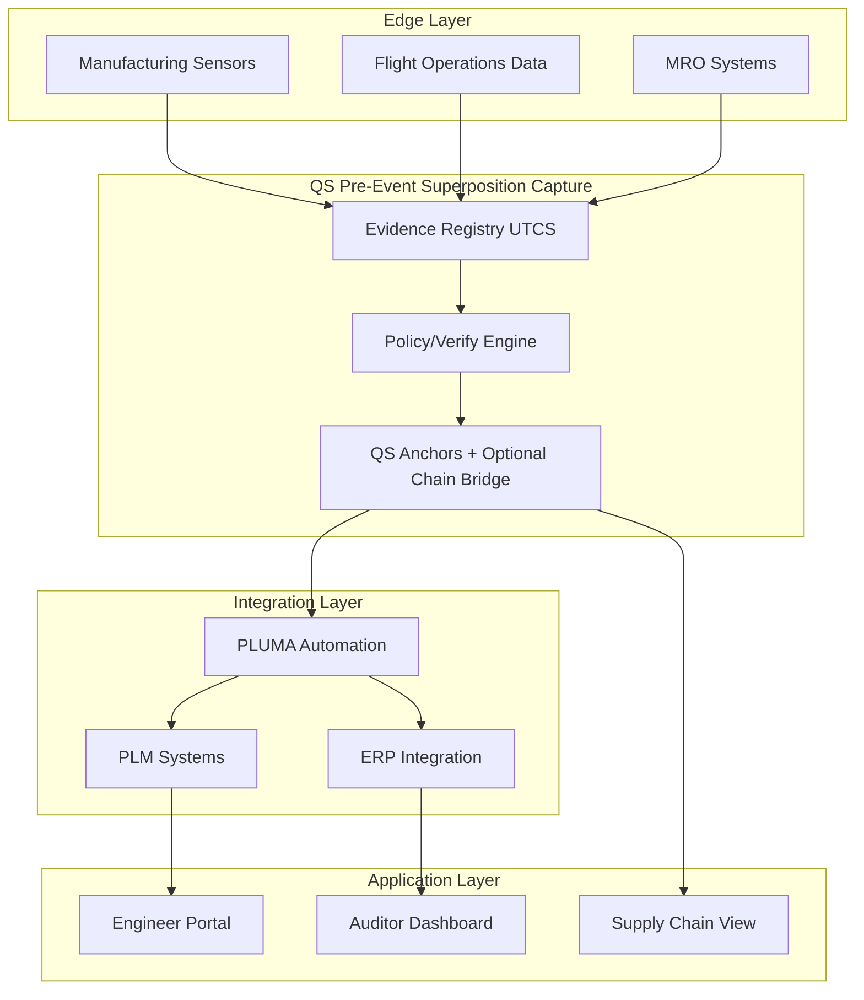
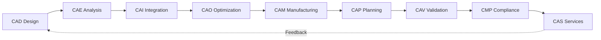

# Aerospace Digital Passports, Reimagined

**IDEALE-EU** transforms aerospace lifecycle management through QS-anchored digital passports, ensuring tamper-proof provenance from design to retirement. Built on **UTCS manifests** with **QS pre-event superposition capture** and PLUMA automation, IDEALE-EU delivers the complete digital thread for mission-critical aerospace systems.

## Revolutionary platform delivering

**Immutable provenance** via **QS pre-event superposition capture** of UTCS manifests and **CB post-event anchoring** ensures every component’s history is cryptographically secured and instantly verifiable. **Complete lifecycle visibility** across all 9 CAx phases—from CAD design through **CAS services** and **end of life**—provides transparent traceability. **TFA (Threading Functional Architecture)** with 15 canonical domains structures complex aerospace data for efficient management. **PLUMA integration** automates lifecycle UiX workflows, reducing manual overhead while maintaining certification compliance.

The platform addresses key challenges: counterfeit prevention, instant certification verification, predictive maintenance through federated fleet learning, and sustainable technologies including H₂ systems tracking and energy-harvesting sensor integration.

### Automatic and Autonomous Digital Passport-iDP

**Purpose**  
Extend IDEALE-EU with an Automatic and Autonomous Digital Passport (iDP) that self-generates, validates, and maintains UTCS-anchored passports with minimal human input.

**Core functions**
- Autonomous registration: detect new parts or digital assets in PLM/ERP and auto-instantiate UTCS manifests.
- Self-verifying integrity: continuous QS pre-event capture with checksum drift detection and CB post-event anchoring.
- Cognitive validation: AI checks evidence completeness, certification schema conformance, and anomalies.
- Federated interaction: FE logic coordinates cross-party updates with QS↔CB handshakes.
- Smart evolution: learn lifecycle signatures and propose corrections or schema upgrades.
- Context sync: auto-merge CAD/CAE, PLM, and MRO metadata to keep threads consistent.

**Generative iDP capabilities**
- Corrective procedure paths with ECR/ECO-ready diffs.
- Cryptographic roadmaps with key rotation and PQC plans.
- Schedule prediction for inspections and audits at object/entity level.
- UTCS extensions (YAML) and control notes auto-drafted from context.

**Architecture**
```mermaid
graph TB
  A[Edge Sensors & PLM Feeds] --> B[Autonomous Detection Layer]
  B --> C[UTCS iDP Generator]
  C --> D[AI Validation Engine]
  D --> E[QS/CB Anchor Manager]
  E --> F[Federated Exchange Bus]
  F --> G[Audit & Governance Portal]
````

**Components**

| Layer      | Module               | Function                                                           |
| ---------- | -------------------- | ------------------------------------------------------------------ |
| Detection  | Event Monitors       | Watch PLM/ERP/MES/CAD repos for new or modified entities           |
| Generation | iDP Constructor      | Compose UTCS templates, assign IDs, start QS capture               |
| Validation | Compliance Engine    | Verify schema integrity, evidence links, regulatory alignment      |
| Anchoring  | QS/CB Anchor Service | Manage pre-event capture, post-event proofs, immutable logs        |
| Federation | Exchange Broker      | Synchronize updates across partners and handle conflict resolution |
| Governance | Policy Orchestrator  | Rulesets, smart-contract enforcement, dashboards and audit exports |

**Integration**

* Triggers and actions via PLUMA workflows.
* Identity resolution against the UTCS registry.
* APIs for ATA/CAx systems and digital-twin sync (REST and gRPC).
* Emits `UTCS.md`, `SCHEMA.(json|yaml)`, and `POLICY.yaml` for each leaf.

**Benefits**

* ~90% reduction in manual passport creation effort.
* Shorter certification lead times via autonomous compliance checks.
* Continuous trust maintenance across hardware, software, and models.

#### Digital passports for maintainable source code modules

Software and model artifacts receive passports with UTCS manifests and QS/CB anchoring, focused on maintainability and supply-chain integrity. Scope: versioned libraries, flight/ground software, embedded firmware, ML models, MBSE packages, and simulation decks.

**Maintainability evidence captured**

* Semantic version and changelog linked to signed VCS commits (GPG/Sigstore).
* SBOM (SPDX or CycloneDX) with dependency graph, licenses, and VEX status.
* Code quality signals: static analysis, lint, complexity, test results and coverage, mutation score.
* Vulnerability scans (CVE), policy gates, and remediation SLA.
* Reproducible build attestation (SLSA / in-toto), artifact digest, and provenance metadata.
* Operational SLOs for services, deprecation policy, and end-of-life timetable.

**UTCS manifest (software) — minimal fields**

```yaml
utcs_ref: UTCS-IIS-SW/{module_id}@{semver}
repo: {vcs_provider}/{org}/{project}
path: /{subdir}
commit: {sha}
signer: {pk_id}
ts: {iso8601}
sbom: {spdx_or_cyclonedx_uri}
license: {spdx_id}
build_provenance: {slsa_provenance_uri}
artifacts:
  - type: {library|container|firmware|model}
    digest: {sha256}
qa:
  tests: {passed}/{total}
  coverage: {pct}
  static_analysis: {score}
  vulnerabilities: {open_critical}/{open_high}
policies:
  - {rule_id}: {status}
attestations:
  - {predicate_type}: {uri}
```

**CI/CD rules (software)**

* Block merge if SBOM or `UTCS.md` missing.
* Require signed commits and tags and Codeowners review.
* Fail if critical vulns > 0 or coverage < threshold.
* Require SLSA-level provenance and reproducible-build attestation before CB.

**Path schema examples**

```
/ORG/IDEALEEU/PROGRAM/BWB-H2-01/THREAD/SW-IIS-2025-000111
└── STATE/QS/LAYER/L2/MODEL/DOMAIN/IIS/PAX/ONB/SOFTWARE/{MODULE}/
    ├── UTCS.md
    └── SBOM.spdx.json
└── STATE/CB/LAYER/L1/DATA/DOMAIN/IIS/PAX/ONB/BUILDS/{VERSION}/
    ├── PROVENANCE.intoto.jsonl
    └── ARTIFACT.sha256
```

### UTCS + QS evidence architecture



**UTCS** = **UiX Threading Context/Content/Cache and Structure/Style/Sheet**.
**Flow**: **QS → FWD → UE → FE → CB → QB**

* **QS**: Pre-event superposition capture
* **FWD**: Predictive/retrodictive wave dynamics
* **UE**: Classical unit elements
* **FE**: Federated multi-party coordination
* **CB**: Post-event classical anchoring
* **QB**: Quantum optimization strategies

### TFA: 15 canonical domains

| Code    | Domain Name                          | Purpose                                               |
| ------- | ------------------------------------ | ----------------------------------------------------- |
| **AAA** | Airframes-Aerodynamics-Airworthiness | Structural integrity, aero performance, certification |
| **AAP** | Airport-Adaptable-Platforms          | Ground operations, GSE, parking/mooring               |
| **CCC** | Cockpit-Cabin-Cargo                  | Flight deck, passenger space, freight systems         |
| **CQH** | Cryogenics-Quantum-H2                | Hydrogen systems, quantum sensors, ultra-cold tech    |
| **DDD** | Drainage-Dehumidification-Drying     | Moisture control, environmental conditioning          |
| **EDI** | Electronics-Digital-Instruments      | Avionics, sensors, data acquisition                   |
| **EEE** | Electrical-Endocircular-Energization | Power generation and distribution, energy harvesting  |
| **EER** | Environmental-Emissions-Remediation  | Fire protection, pollution control, sustainability    |
| **IIF** | Industrial-Infrastructure-Facilities | Manufacturing, tooling, ground facilities             |
| **IIS** | Information-Intelligence-Systems     | Software, AI, data analytics, cybersecurity           |
| **LCC** | Linkages-Control-Communications      | Flight controls, datalinks, autonomy                  |
| **LIB** | Logistics-Inventory-Blockchain       | Supply chain, parts tracking, passport logistics      |
| **MMM** | Mechanical-Material-Modules          | Materials science, mechanical systems, MRO            |
| **OOO** | Operations-Optimization-Outcomes     | Fleet operations, performance analytics               |
| **PPP** | Propellers-Propellents-Propulsion    | Propulsion systems and fuel management                |

Each domain aligns to ATA iSpec 2200. Publications integrate with **Centralized Source Database (CSDB)**.

### CAx lifecycle: 9 phases “to scale”



### PLUMA: Lifecycle automation platform

Low-code PLM integration, AI compliance checking, S1000D generation with CSDB integration, and real-time dashboards. Workflows include ECR/ECO/CCB routing, certification package generation, supplier portal automation, and MRO feedback.

## Architecture and implementation

### Applied TFA path grammar, domains, and UTCS anchoring

**Path schema**

```
/ORG/{ORG_CODE}/PROGRAM/{PGM_CODE}/THREAD/{THREAD_ID}
/STATE/{QS|FWD|UE|FE|CB|QB}/LAYER/{L1|L2|L3|L4}
/DOMAIN/{AAA…PPP}/PAX/{ONB|OUT}/{PACKAGE}/{ITEM}
```

* `STATE` = QS → FWD → UE → FE → CB → QB
* `LAYER` = L1=DATA, L2=MODEL, L3=SERVICE, L4=APP
* `DOMAIN` = 15 TFA domains (AAA…PPP)
* `PAX` = ONB | OUT
* Every leaf contains `UTCS.md` `{utcs_ref, checksum, signer, ts}` and passes FCR-1/2.

**Example scaffold**

```
/ORG/IDEALEEU/PROGRAM/BWB-H2-01/THREAD/PP-AAA-2025-001234
└── STATE/QS
    ├── LAYER/L1/DATA/DOMAIN/AAA/PAX/ONB/MDM/MASTER_CATALOG/MATERIALS/
    │   ├── UTCS.md
    │   └── Ti/TI6AL4V_SPEC.pdf
    ├── LAYER/L1/DATA/DOMAIN/AAA/PAX/ONB/PLM_PDM/STRUCTURES/PROGRAM_TREE/
    │   └── UTCS.md
    ├── LAYER/L2/MODEL/DOMAIN/AAA/PAX/ONB/MBSE/SYSML_MODELS/REQUIREMENTS/
    │   └── UTCS.md
    ├── LAYER/L3/SERVICE/DOMAIN/AAA/PAX/ONB/SIMULATION/PHYSICS_ENGINES/ANSYS/
    │   └── UTCS.md
    └── LAYER/L4/APP/DOMAIN/AAA/PAX/ONB/DASHBOARDS/KPI_MONITORING/
        └── UTCS.md
```

**State progression**

```
.../STATE/QS/LAYER/L2/MODEL/.../CAE/FEM/MESHES/          # pre-event
.../STATE/FWD/LAYER/L3/SERVICE/.../SIMULATION/RESULTS/   # exploration
.../STATE/UE /LAYER/L3/SERVICE/.../ANALYTICS/PREDICTIVE/  # evaluation
.../STATE/FE /LAYER/L3/SERVICE/.../VALIDATION/REPORTS/    # acceptance
.../STATE/CB /LAYER/L1/DATA/.../TIMESERIES/LABELING/      # post-event
.../STATE/QB /LAYER/L4/APP/.../DASHBOARDS/COMPLIANCE/     # baselined
```

**Per-folder required files**
`README.md`, `SCHEMA.(json|yaml)`, `UTCS.md`, `POLICY.yaml`

**CI rules (minimal)**

* Paths must match:

```
^/ORG/[A-Z0-9_-]+/PROGRAM/[A-Z0-9-]+/THREAD/[A-Z0-9-]+/STATE/(QS|FWD|UE|FE|CB|QB)/LAYER/(L[1-4])/
DOMAIN/[A-Z]{3}/PAX/(ONB|OUT)/.*
```

* Block merges if `UTCS.md` or `README.md` missing at any new directory.
* FCR-1 runs on QS/FWD; FCR-2 on FE/CB before QB tagging.

## Frozen context management

Baselines capture certification states, requirement sets, design configurations, and manufacturing standards. Time-travel queries reconstruct historical states. QS anchoring prevents retroactive modification and logs tamper attempts with PKI audit trails.

## Repository index and search

Semantic search with aerospace terminology, multilingual support, and faceted filtering by TFA domain, CAx phase, ATA chapter, program, certification status, supplier, dates, and component type.

```
