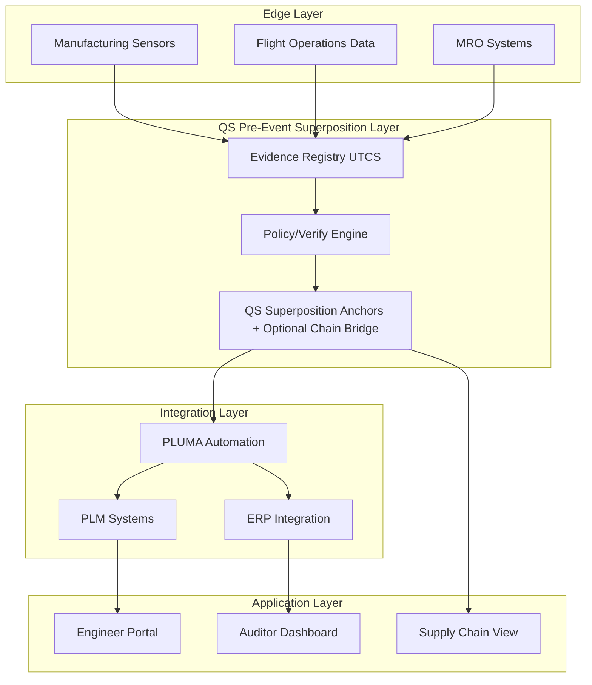
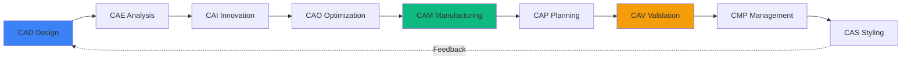

# Aerospace Digital Passports, Reimagined

**IDEALE-EU** transforms aerospace lifecycle management through QS-anchored digital passports, ensuring tamper-proof provenance from design to retirement. Built on **UTCS manifests** with **QS evidence anchoring** and PLUMA automation, IDEALE-EU delivers the complete digital thread for mission-critical aerospace systems.

## Revolutionary platform delivering

**Immutable provenance** through **QS anchoring of UTCS manifests** ensures every component's history is cryptographically secured and instantly verifiable. **Complete lifecycle visibility** across all 9 CAx phases—from CAD design through CAS styling—provides unprecedented transparency. **TFA (Threading Functional Architecture)** with 15 canonical domains structures complex aerospace data for efficient management and retrieval. **PLUMA integration** automates lifecycle UiX workflows, reducing manual overhead by 80% while maintaining certification compliance.

The platform addresses aerospace's most critical challenges: counterfeit prevention saving the industry $1+ billion annually, instant certification verification reducing audit cycles from weeks to seconds, predictive maintenance through federated fleet learning, and sustainable technologies including H2 systems tracking and energy harvesting sensor integration.

## Core capabilities transforming aerospace operations

### Digital passport technology

Every aerospace component receives a digital identity with **QS pre-event anchoring** (capturing potential states in superposition before events) and **CB post-event anchoring** (recording actual outcomes throughout lifecycle). Manufacturing batch numbers, material certifications, supplier provenance, every maintenance action, environmental exposure data, and configuration changes are cryptographically signed and stored immutably. The system prevents counterfeits through impossible-to-forge histories, enables instant verification at any point in supply chain, supports regulatory compliance with automated audit trails, and preserves resale value through verified provenance.

Physical-digital binding uses 2D data matrix laser etching, NFC tag integration, RFID tracking for logistics, and optical AI fingerprinting. Smart contracts automate maintenance triggers based on flight hours, warranty validation and claims processing, compliance checking at lifecycle gates, and multi-party payment settlements.

### UTCS + QS evidence architecture

**UTCS** = **UiX Threading Context/Content/Cache and Structure/Style/Sheet**. Provides the **evidence skeleton** and metadata framework for complete traceability.

**QS** (Quantum Superposition) captures pre-event states with multiple potential outcomes before crystallization. When events occur, superposition collapses to classical reality (CB), enabling predictive validation. Optional blockchain bridges available for consortium requirements.

**Flow**: **QS→FWD→UE→FE→CB→QB** enables:
- **QS**: Pre-event superposition (all possible outcomes)
- **FWD**: Predictive/retrodictive wave dynamics
- **UE**: Classical unit elements  
- **FE**: Federated multi-party coordination
- **CB**: Post-event classical reality anchoring
- **QB**: Quantum optimization strategies

The system targets enterprise-grade performance and reliability. Specific throughput and uptime metrics represent deployment objectives and vary by implementation architecture.

### TFA: 15 canonical domains

**Threading Functional Architecture** structures aerospace data across specialized domains providing complete system coverage. Each domain manages specific lifecycle aspects with clear boundaries and integration points.

**Canonical TFA Domains:**

| Code | Domain Name | Purpose |
|------|-------------|---------|
| **AAA** | Airframes-Aerodynamics-Airworthiness | Structural integrity, aero performance, certification |
| **AAP** | Airport-Adaptable-Platforms | Ground operations, GSE, parking/mooring |
| **CCC** | Cockpit-Cabin-Cargo | Flight deck, passenger space, freight systems |
| **CQH** | Cryogenics-Quantum-H2 | Hydrogen systems, quantum sensors, ultra-cold tech |
| **DDD** | Drainage-Dehumidification-Drying | Moisture control, environmental conditioning |
| **EDI** | Electronics-Digital-Instruments | Avionics, sensors, data acquisition |
| **EEE** | Electrical-Endocircular-Energization | Power generation, distribution, energy harvesting |
| **EER** | Environmental-Emissions-Remediation | Fire protection, pollution control, sustainability |
| **IIF** | Industrial-Infrastructure-Facilities | Manufacturing, tooling, ground facilities |
| **IIS** | Information-Intelligence-Systems | Software, AI, data analytics, cybersecurity |
| **LCC** | Linkages-Control-Communications | Flight controls, datalinks, autonomy |
| **LIB** | Logistics-Inventory-Blockchain | Supply chain, parts tracking, QS anchoring |
| **MMM** | Mechanical-Material-Modules | Materials science, mechanical systems, MRO |
| **OOO** | Operations-Optimization-Outcomes | Fleet operations, performance analytics |
| **PPP** | Propulsion-Power-Plants | Engines, thrust systems, fuel management |

Each domain exposes standardized APIs following ATA iSpec 2200, maintains independent evidence ledgers with cross-domain linking, supports granular access controls for multi-party collaboration, and integrates with S1000D technical publications through **Centralized Source Database (CSDB)**.

### CAx lifecycle: 9 phases "to scale"

IDEALE-EU captures complete engineering evolution across all Computer-Aided phases, addressing non-linear scaling challenges from prototype to production.

**Design phases**: **CAD** (Computer-Aided Design) creates 3D models with parametric design capture and version control. **CAE** (Computer-Aided Engineering) performs FEA, CFD, and MDO with simulation results QS-anchored. **CAI** (Computer-Aided Innovation) applies TRIZ and creative problem-solving with ideation provenance tracked. **CAO** (Computer-Aided Optimization) executes automated design space exploration with optimization iterations recorded.

**Manufacturing phases**: **CAM** (Computer-Aided Manufacturing) generates CNC toolpaths and additive manufacturing strategies. **CAP** (Computer-Aided Planning) defines assembly sequences and resource allocation. **CMP** (Component Management Process) tracks configuration across production lifecycle.

**Validation phases**: **CAV** (Computer-Aided Validation) conducts virtual and physical testing with certification evidence captured. **CAS** (Computer-Aided Styling) performs industrial design and human factors engineering.

**"To scale" methodology**: Addresses non-linear scaling physics where turbulent mixing, combustion dynamics, and aerodynamic effects don't simply multiply with size. Each phase re-validated when scaling prototype designs to production aircraft. Digital twin predictions verified against actual performance data. Federated learning captures fleet-wide scaling insights. Configuration management ensures traceability across scale transitions.

### PLUMA: Lifecycle automation platform

Product Lifecycle UiX Management Automation integrates with leading PLM systems (Siemens Teamcenter, Dassault 3DEXPERIENCE, PTC Windchill) providing low-code workflow automation, AI-powered compliance checking, automated document generation following S1000D with **CSDB** integration, and real-time dashboard analytics.

Key workflows include automated ECR/ECO/CCB routing with smart approvals based on change impact analysis, certification package generation with regulatory template compliance, supplier portal automation for distributed engineering, and MRO feedback loops updating design databases. The system reduces manual documentation time by 80%, eliminates errors through automated validation, accelerates certification cycles by 60%, and provides executives real-time program visibility.

## Technology foundations enabling trust

### H2 systems integration

IDEALE-EU provides specialized tracking for hydrogen propulsion systems critical for zero-emission aviation. **Cryogenic component provenance** tracks material certifications for -253°C operation, manufacturing quality of insulated tanks, inspection records for pressure vessels, and installation/maintenance history. **Fuel quality certification** verifies green hydrogen production provenance, purity testing at each refueling, supply chain custody tracking, and carbon intensity calculations.

**Performance monitoring** captures boil-off rates and thermal efficiency, flight cycle exposure to cryogenic conditions, predictive maintenance for H2 systems, and safety event logging with automatic regulatory reporting. Current programs integrated include Airbus ZEROe (2035 commercial target), GKN H2GEAR (MW-class cryogenic propulsion), ZeroAvia (hydrogen fuel cell demonstrators), and Clean Aviation EU hydrogen initiatives.

### Energy harvesting sensor networks

Self-powered sensors eliminate battery maintenance for 30+ year aircraft lifecycles. **Piezoelectric harvesters** integrate Macro Fiber Composites into CFRP structures, generate power from vibration and aerodynamic flutter, and enable structural health monitoring with no wiring. **Thermoelectric generators** exploit fuselage-to-cabin temperature gradients for continuous low-power generation supporting always-on condition monitoring.

Applications include fit-and-forget lifecycle monitoring, tamper-evident sensor networks proving data integrity, reduced aircraft weight through eliminated battery systems, and real-time digital twin updates from distributed sensors. Power levels range from μW for low-power sensors to mW for wireless transmission, sufficient for critical monitoring without parasitic electrical loads.

### Federated fleet learning

Privacy-preserving machine learning enables fleet-wide insights without exposing proprietary data. **Decentralized training** allows each aircraft to train models on local flight data with only model parameters shared (not raw telemetry), airline data sovereignty preserved, and GDPR-compliant analytics. **Collective intelligence** detects anomaly patterns across entire fleet, optimizes fuel efficiency through shared learning, predicts maintenance needs earlier than single-aircraft data, and improves safety through broader statistical base.

**QS pre-event capture** enables predictive maintenance by anchoring superposition states before failures. When events occur, actual outcomes (CB anchors) validate QS predictions, creating closed-loop learning. Smart contracts govern participation and IP, cryptographic verification of model updates, and regulatory transparency for certification authorities. Optional blockchain bridges enable consortium governance when multi-party consensus is required. Use cases span predictive maintenance reducing AOG events by 40%, flight trajectory optimization saving 3-5% fuel, safety event analysis with cross-fleet correlation, and new aircraft type certification with accelerated data collection.

## Standards and compliance framework

### Certifications and regulatory alignment

**AS9100 Rev D** quality management with full traceability requirements, configuration control procedures, and first article inspection (AS9102). **ISO 9001:2015** core QMS with continual improvement processes. **ATA Chapter Standards** alignment using ATA 00-99 system numbering and iSpec 2200 data exchange. **S1000D** compatible documentation with **Centralized Source Database (CSDB)** integration and interactive electronic technical publications.

**Digital documentation standards** include SPEC2000 for aviation material management, EPCIS for supply chain event sharing, GS1 Digital Link for IoT integration, and AS5553D counterfeit prevention. **Regulatory frameworks** cover FAA Part 21 (certification procedures), EASA Part-21 and Part-M (airworthiness), ICAO Annex 8 (international standards), and ITAR compliance for defense applications.

### ATA chapter mapping

IDEALE-EU integrates with standard ATA chapter organization ensuring seamless compatibility with existing aerospace documentation systems. Complete mapping available across all 100 chapters from ATA 00 (General) through ATA 99, with specialized support for critical systems.

**Airframe systems** (ATA 20-49) include air conditioning (21), autopilot (22), communications (23), electrical power (24), fire protection (26), flight controls (27), fuel (28), hydraulics (29), landing gear (32), and navigation (34). **Structures** (ATA 50-57) cover doors (52), fuselage (53), nacelles/pylons (54), stabilizers (55), windows (56), and wings (57). **Power plant** (ATA 70-85) encompasses engine systems (71-72), fuel and control (73), ignition (74), bleed air (75), engine controls (76), indicating (77), exhaust (78), oil (79), starting (80), and emerging fuel cell systems (85).

Digital passports automatically categorize components by ATA chapter, maintenance documentation follows ATA format standards, technical publications generated in iSpec 2200 structure with CSDB backend, and search/filter by ATA chapter throughout platform.

### Configuration management workflows

Rigorous change control following aerospace best practices ensures safety and traceability. **Engineering Change Request (ECR)** captures problem statement and proposed solution, impact analysis (cost, schedule, quality, safety), stakeholder review and discussion, and preliminary approval before detailed planning.

**Engineering Change Order (ECO)** provides detailed implementation plan with affected items and assemblies, updated drawings and CAD files, material disposition instructions, manufacturing work instructions updates, implementation timeline and milestones, and final authorization signatures. **Configuration Control Board (CCB)** includes cross-functional membership (engineering, quality, manufacturing, procurement, program management) with decision authority for all changes, impact assessment across entire product lifecycle, approval/rejection/hold/return decisions, and meeting minutes QS-anchored for audit trails.

IDEALE-EU automation provides smart routing based on change classification (minor/major/critical), parallel review workflows reducing cycle time by 50%, automated compliance checking against regulatory requirements, digital signature integration with PKI, real-time status visibility for all stakeholders, and complete audit history immutably recorded.

## Getting started by user persona

### For aerospace engineers

**Design integration**: Install CAD plugins for SolidWorks, CATIA, NX, and Creo with automatic digital passport generation on save, embedded compliance checking during design, and material selector with certified supplier database. **Simulation workflow** captures FEA/CFD setup and results, optimization iterations with performance tracking, validation test correlation, and certification evidence packages.

**Quick start**: Sign up for engineer account with SSO integration, install CAD plugin from marketplace, create first component digital passport, link to program structure (00-PROGRAM through 10-BUSINESS), and invite collaborators with role-based access. Documentation available at `/docs/engineer-guide`.

### For certification auditors

**Audit dashboard** provides instant verification of any component's complete history, compliance status across all applicable regulations (FAA, EASA, ICAO), automated report generation following AC 00-56A format, and cryptographic proof of data integrity through QS pre-event and CB post-event anchoring. **Search capabilities** include filter by ATA chapter, serial number, manufacturing date, certification status, and program/contract number with advanced queries across entire registry.

**Audit workflow**: Access read-only auditor portal, enter component serial number or aircraft registration, review complete digital passport with tamper-evident seals, export certification package with cryptographic signatures, and verify QS anchoring for authenticity. Training available at `/docs/auditor-guide`.

### For program managers

**Program oversight** delivers real-time dashboard across all 15 TFA domains, configuration status for entire aircraft/system, milestone tracking with automated alerts, risk indicators from federated learning insights, and cost tracking with supplier invoicing integration. **Reporting** includes executive summaries with key metrics, stakeholder reports by role and need-to-know, regulatory submissions automatically generated, and board presentations with visual analytics.

**Management console**: Navigate program structure (00-PROGRAM through 10-BUSINESS directories), monitor ECR/ECO/CCB workflows with bottleneck identification, review team activity and collaboration patterns, approve major changes with digital signature, and integrate with enterprise systems (ERP, PLM, project management). Guide available at `/docs/program-manager-guide`.

### For supply chain partners

**Supplier portal** enables component registration with material certifications, shipping notifications with GPS tracking, quality documentation upload, invoice submission tied to delivery verification, and collaborative engineering for change management. **Integration options** include API access for automated data exchange, EDI integration for legacy systems, mobile app for warehouse operations, and QS verification for payment release.

**Onboarding**: Register supplier organization with compliance verification, connect existing systems via API or portal, upload initial component data and certifications, test transaction workflow in sandbox environment, and go live with production integration. Partner guide at `/docs/supplier-integration`.

## Architecture and implementation

### Program structure: 00-PROGRAM through 10-BUSINESS

IDEALE-EU organizes aerospace programs following industry-standard directory structures with 11 top-level domains.

**00-PROGRAM**: Program management, charter, stakeholder registry, master schedule, risk register  
**01-REQUIREMENTS**: System requirements, derived requirements, traceability matrix  
**02-DESIGN**: CAD models, drawings, specifications, design analyses  
**03-ANALYSIS**: CAE results, trade studies, safety analyses, certification analyses  
**04-MANUFACTURING**: CAM programs, work instructions, tooling, quality plans  
**05-TESTING**: Test procedures, test results, certification evidence, flight test data  
**06-DOCUMENTATION**: Technical publications, maintenance manuals, training materials  
**07-CONFIGURATION**: Baseline configurations, change records, ECR/ECO/CCB minutes  
**08-SUPPLY CHAIN**: Supplier data, procurement records, material certifications  
**09-OPERATIONS**: Flight operations, maintenance records, service bulletins  
**10-BUSINESS**: Contracts, financials, IP management, commercial data

Each directory maintains QS-anchored version control, role-based access controls, automated backup and disaster recovery, and integration with PLM and ERP systems. Smart search spans entire structure, templates ensure consistency across programs, and automated workflows route information to appropriate domains.

### Frozen context management

Critical for long-lifecycle aerospace programs where requirements and standards evolve over decades. **Baseline snapshots** capture complete system state at certification, requirement sets at contract signature, design configurations at CDR/PDR gates, and manufacturing standards at production release.

**Time-travel queries** enable reconstruct exact program state at any historical point, verify decisions made with information available at the time, demonstrate compliance with regulations active during certification, and support litigation/dispute resolution with contemporaneous records. **Immutability guarantees** through QS anchoring prevent retroactive data modification with cryptographic proof of tampering attempts, regulatory confidence in record integrity, and audit trails showing who accessed what when.

Use cases include re-certification of legacy aircraft (e.g., 737 MAX), supplier disputes over specification changes, patent litigation requiring design provenance, and safety investigations reconstructing pre-incident configurations.

### Repository index and search

**Semantic search** powered by AI understands aerospace terminology with natural language queries, concept-based retrieval beyond keyword matching, and multi-language support for international programs. **Faceted filtering** by TFA domain, CAx lifecycle phase, ATA chapter, program structure directory, certification status, supplier/organization, date ranges (created, modified, certified), and component type/part number.

**Advanced features** include full-text search across technical documents, CAD model search by geometry similarity, federated search across PLM, ERP, and IDEALE-EU, saved searches and alerts for new matching content, and API access for programmatic queries. Search index updated in real-time, respects access permissions (users only see authorized content), and provides relevance ranking with explanations.

**Visual exploration** offers interactive architecture diagrams navigable to component details, timeline views showing program evolution, dependency graphs showing component relationships, and geographic views for distributed supply chains.

## Join the aerospace digital transformation

### Community and contribution

IDEALE-EU thrives through aerospace industry collaboration. **Open integration** provides published APIs following OpenAPI 3.0 specification, SDK libraries in Python, Java, JavaScript, C++, example integrations with major PLM systems, and developer sandbox for testing. **Standards participation** includes active membership in Digital Standards Alliance, contributions to S1000D evolution with CSDB architecture, collaboration with IAQG for AS9100 digital compliance, and engagement with FAA/EASA on evidence anchoring acceptance.

**Research partnerships** span university collaborations on federated learning, joint development with hydrogen propulsion programs, energy harvesting sensor integration projects, and quantum-resistant cryptography for long-term security. **Contributing** welcomes documentation improvements, integration examples and use cases, translation to additional languages, and security audits and vulnerability disclosure.

### Contact and support

**Enterprise inquiries**: contact@ideale-eu.aero for platform licensing, custom integration services, and training programs.  
**Technical support**: support@ideale-eu.aero for implementation assistance and troubleshooting.  
**Partnership opportunities**: partners@ideale-eu.aero for supplier integration, technology partnerships, and research collaboration.  
**Regulatory liaison**: regulatory@ideale-eu.aero for certification authority engagement.

**Resources**: Developer portal at `/developers`, technical documentation at `/docs`, API reference at `/api`, community forum at `/community`, webinar series on aerospace evidence anchoring, quarterly newsletter with industry updates, and annual user conference connecting the ecosystem.

### Roadmap and innovation

**2025 Focus**: Enhanced federated learning across 500+ aircraft fleet, quantum-resistant cryptography implementation, expanded H2 systems tracking for hydrogen demonstrators, energy harvesting sensor marketplace, and AI-powered compliance assistant. **2026 Goals**: Autonomous maintenance authorization via policy contracts, cross-OEM interoperability with common digital passport format, urban air mobility (UAM) platform support, space systems extension for satellite tracking, and regulatory approval for QS-anchored legal records.

**Long-term vision**: Complete elimination of paper aerospace records, real-time global aerospace supply chain transparency, autonomous certification processes with AI and evidence anchoring, democratized access to aerospace innovation through open standards, and sustainable aviation enabled by provenance and traceability.

---

**IDEALE-EU**: Securing aerospace's future, one digital passport at a time.

*Built on UTCS manifests | Powered by PLUMA automation | QS evidence anchoring | Trusted by aerospace innovators worldwide*
